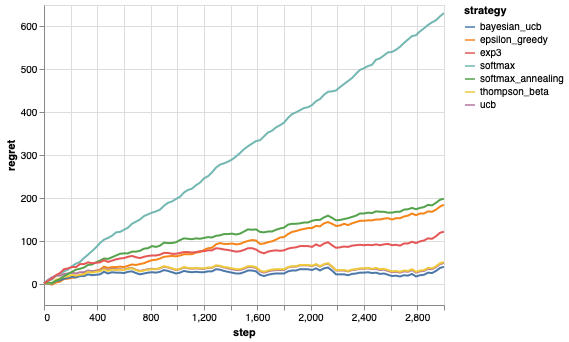

# Multi-Armed Bandit

This repo contains a simple framework to run multi-armed bandit algorithms with a configurable bandit to generate experimental results. It consists of 4 components:
- [bandit](src/bandit.py) - implementation of bandit machine.
- [strategy](src/strategy.py) - implementation of popular algorithms with unified interface.
    - Epsilon-greedy algorithm
    - Upper Confidence Bound algorithm
    - Bayesian Upper Confidence Bound algorithm
    - Thompson Sampling algorithm
    - Softmax algorithm
    - Exp3 algorithm
- [environment](src/environment.py) - create one-time run environment with a given bandit and multi-armed bandit algorithms.
- [experiment](src/experiment.py) - multiple runs of a given environment.

In addition, [enviroment](src/environment.py) provides functions to generate analytical charts on algorithms execution shown as below:

The use of the framework is presented in [demo](demo.ipynb). The plot outputs in notebook may fail to render on Github. Alternatively, you can see notebook with renderred plots at [demo on nbviewer](https://nbviewer.jupyter.org/github/Frank3W/multi_armed_bandit/blob/main/demo.ipynb)
